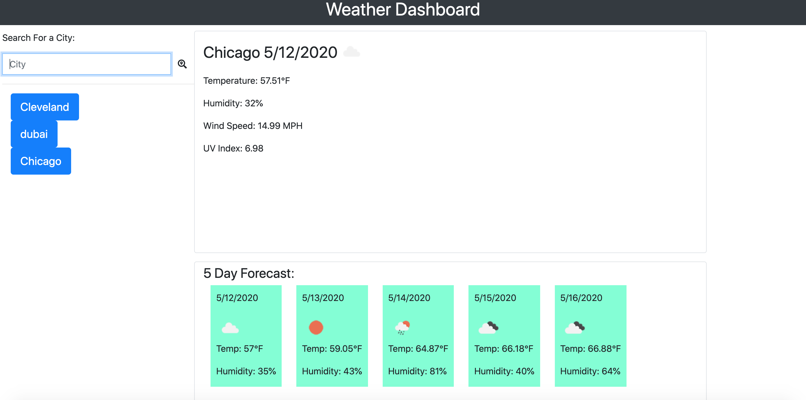

# Weather-Dashboard
Weather-app
A real time weather dashboard application with search functionality to find current weather conditions and the future weather outlook for multiple cities.

https://jreg1258.github.io/Weather-Dashboard/weather.html

User Story
As a traveler I want to see the weather outlook for multiple cities so that I can plan a trip accordingly

Getting Started
Copy the repository by downloading the zip file or git cloning into the folder of your choice as pictured below.

Use the OpenWeather API (https://openweathermap.org/api) to retrieve weather data for cities. The following documentation includes a section called "How to start" that will provide basic setup and usage instructions (https://openweathermap.org/appid).

Use AJAX to hook into the API to retrieve data in JSON format.

Then open the application in your browser by right clicking on the weather.html file in your code editor and selecting 'Open in Default Broswer' as pictured below.

The app will run in the browser and feature dynamically updated HTML and CSS powered by jQuery.

Built With
VSCode, Javascript, JQuery, AJAX, OpenWeather API, HTML5, CSS3

Features
The appp will display the following under current weather conditions:

City

Date

Icon image (visual representation of weather conditions)

Temperature

Humidity

Wind speed

UV index

The app includes a search history so that users can access their past search terms. Clicking on the city name should perform a new search that returns current and future conditions for that city.

Include a 5-Day Forecast below the current weather conditions. Each day for the 5-Day Forecast should display the following:

Date

Icon image (visual representation of weather conditions)

Temperature

Humidity
